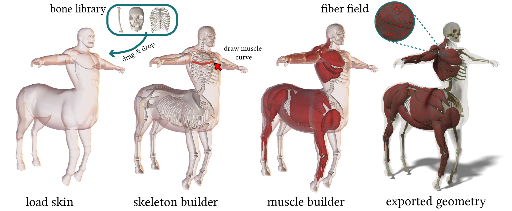

title: Interactive Modelling of Volumetric Musculoskeletal Anatomy
author: Rinat Abdrashitov, Seungbae Bang, David I.W. Levin, Karan Singh, Alec Jacobson
html header: <meta property="og:image" content="http://www.dgp.toronto.edu/projects/cubic-stylization/teaser.jpg" />
<meta property="og:description" content="We present a new approach for modelling musculoskeletal anatomy. Unlike previous methods, we do not model individual muscle shapes as geometric primitives (polygonal meshes, NURBS etc.). Instead, we adopt a volumetric segmentation approach where every point in our volume is assigned to a muscle, fat, or bone tissue. We provide an interactive modelling tool where the user controls the segmentation via muscle curves and we visualize the muscle shapes using volumetric rendering. Muscle curves enable intuitive yet powerful control over the muscle shapes. This representation allows us to automatically handle intersections between different tissues (musclemuscle, muscle-bone, and muscle-skin) during the modelling and automates computation of muscle fiber fields. We further introduce a novel algorithm for converting the volumetric muscle representation into tetrahedral or surface geometry for use in downstream tasks. Additionally, we introduce an interactive skeleton authoring tool that allows the users to create skeletal anatomy starting from only a skin mesh using a library of bone parts.
" />
<meta name="twitter:card" content="summary"></meta>
<meta name="og:title" content="Cubic Stylization"></meta>
css: style.css

# Interactive Modelling of Volumetric Musculoskeletal Anatomy _SIGGRAPH 2021_

<div class=authors>

RINAT ABDRASHITOV, SEUNGBAE BANG, DAVID I.W. LEVIN, KARAN SINGH, ALEC JACOBSON

University of Toronto

</div>



## Abstract
We present a new approach for modelling musculoskeletal anatomy. Unlike previous methods, we do not model individual muscle shapes as geometric primitives (polygonal meshes, NURBS etc.). Instead, we adopt a volumetric segmentation approach where every point in our volume is assigned to a muscle, fat, or bone tissue. We provide an interactive modelling tool where the user controls the segmentation via muscle curves and we visualize the muscle shapes using volumetric rendering. Muscle curves enable intuitive yet powerful control over the muscle shapes. This representation allows us to automatically handle intersections between different tissues (musclemuscle, muscle-bone, and muscle-skin) during the modelling and automates computation of muscle fiber fields. We further introduce a novel algorithm for converting the volumetric muscle representation into tetrahedral or surface geometry for use in downstream tasks. Additionally, we introduce an interactive skeleton authoring tool that allows the users to create skeletal anatomy starting from only a skin mesh using a library of bone parts.

## Downloads
 - [Paper (98MB)](musclegeometry-acmtog.pdf)
 - [ArXiv (9MB)](coming_soon)
 <!-- - [Paper (9MB)](musclegeometry-acmtog.pdf) -->
 - [Video](coming_soon)
 - [Code](coming_soon)
<!-- ## Video -->

<!-- Embed Youtube video here -->

## BibTeX
```
@article{Abdrashitov:Musculoskeletal:2021,
  title = {Interactive Modelling of Volumetric Musculoskeletal Anatomy},
  author = {Rinat Abdrashitov, Seungbae Bang, David I.W. Levin, Karan Singh, Alec Jacobson},
  year = {2021},
  journal = {ACM Transactions on Graphics}, 
}
```

## Acknowledgements 
Our research is funded in part by NSERC Discovery (RGPIN-2017-05524, RGPIN2017–05235, RGPAS–2017–507938), NSERC Accelerator (RGPAS-2017- 507909), Connaught Fund (503114), CFI-JELF Fund, Canada Research Chairs Program, New Frontiers of Research Fund (NFRFE–201), the Ontario Early Research Award program, the Fields Centre for Quantitative Analysis and Modelling and gifts by Adobe Systems, Autodesk and MESH Inc. 
We thank Sarah Kushner and Abhishek Madan for proofreading; Vismay Modi for helping to generate the simulation results; Oded Stein for helping with figures; anonymous reviewers for their helpful comments and suggestions. Special thanks to SideFx software for providing their models.

<!-- `multimarkdown --process-html -o index.{html,md}` -->

